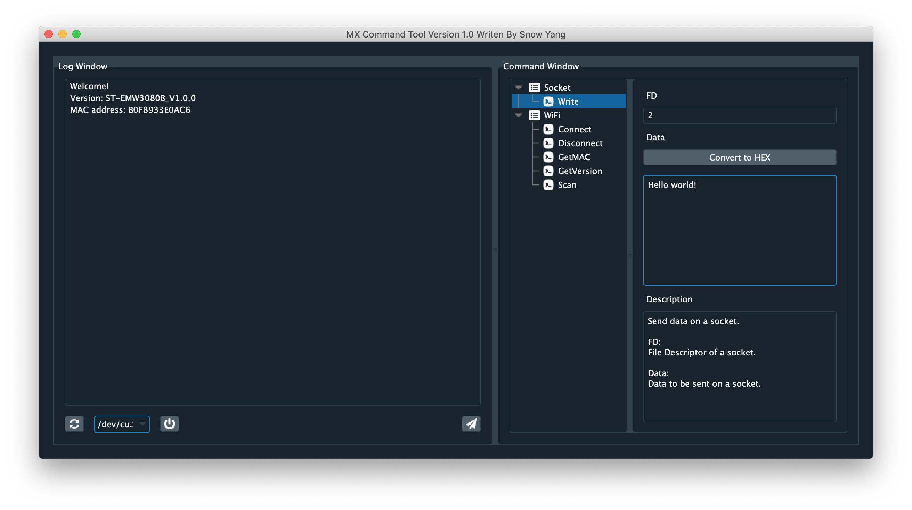

```
Author: Snow Yang
```

# 安装

## 安装 Python3 

```
$ brew install python3
```

国内的 homebrew 太慢了，可以切换到国内镜像（中国科技大学镜像）

### 替换及重置Homebrew默认源

替换brew.git:
```
cd "$(brew --repo)"
git remote set-url origin https://mirrors.ustc.edu.cn/brew.git
```

替换homebrew-core.git:
```
cd "$(brew --repo)/Library/Taps/homebrew/homebrew-core"
git remote set-url origin https://mirrors.ustc.edu.cn/homebrew-core.git
```

### Homebrew Bottles源

对于bash用户：

```
echo 'export HOMEBREW_BOTTLE_DOMAIN=https://mirrors.ustc.edu.cn/homebrew-bottles' >> ~/.bash_profile
source ~/.bash_profile
```

对于zsh用户

```
echo 'export HOMEBREW_BOTTLE_DOMAIN=https://mirrors.ustc.edu.cn/homebrew-bottles' >> ~/.zshrc
source ~/.zshrc
```

## 安装依赖包

```
$ pip3 install qdarkstyle==2.7 pyqt5==5.10.1 pyserial
```

## 运行

```
$ ./MXCommandTool
```



# 自定义命令

## 脚本即命令

MXCommandTool 扫描 `Command` 目录内的脚本文件，并将其展示在 `Command Windows` 界面中。

一个脚本实现一个命令，因此，用户可以非常方便和灵活地扩展命令集。


## 自定义命令

只需要实现三个函数即可:

* getWidget
* encode
* decode

### getWidget

创建一个参数界面，供主界面展示

### encode

获取用户输入的参数，组成 IPC 包

### decode

MXCommandTool 收到一包数据后，会遍历调用所有 Command 的 decode 函数以尝试解析。此函数格式化 IPC 载荷数据，供主界面展示

下面是获取 MAC 地址的命令示例:

```
from mxArgWidgets import *

class Command():

    def getWidget(self):
        self.widget = MxArgsWidget('Get Wi-Fi MAC address.')
        return self.widget

    def encode(self):
        return b'\x04\x10'

    def decode(self, cmd, payload):
        if cmd != b'\x03\x20':
            return None
        return 'MAC address: %s' % (payload[3:].hex().upper())
```